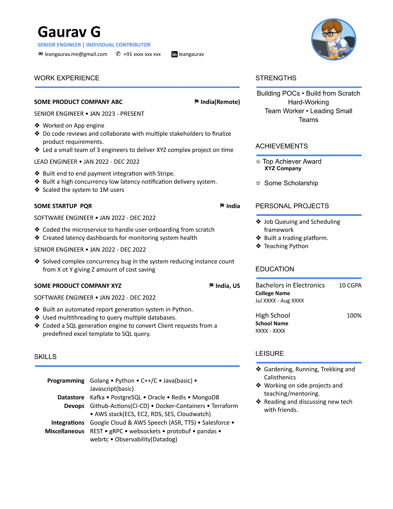

# Resume

This repo contains resume templates. These are simple resume templates built using Google Docs. 
- Easy to customize and use.
- Simple: no need to learn LaTeX (LaTeX is great, but takes initial time investment).
- Access anywhere. Stored in Goole Docs ☁. 

**Note:** While opening on phone, use print layout to see how it's going to look. Still Mobile view might have issues, so view on Desktop/Laptop or use `Desktop View` in mobile browser. Also see tips section  
Start/Watch the repo for updates

---
### Available Templates  

**One Page Templates**  
|  |  |
|--|--|
| | [Template-1 Click to Open](https://docs.google.com/document/d/12VKwOvPnLgnE_zsFa1UYK3yZ30qsT9-k6uogBVpYLwc) |
| | [Template-2 Click to Open](https://docs.google.com/document/d/1wfkEG4Xyh24PpT_IQlOtC9ee_lfN_OPHIMgVauWIsuE) |
| | [Template-3 Click to Open](https://docs.google.com/document/d/1W7rXRlcVjNUmGRlmOjBvzdrTv5u-0wH3JeWUnWVXWVo) |
| | [Template-4 Click to Open](https://docs.google.com/document/d/1cKGKqau_Q0f_DiI7437XQz8KhNB51pQkkF1zWbj4e-0) |
| | [Template-5 Click to Open](https://docs.google.com/document/d/1yx-bhUF91xeq-mwlk2iAmU3pEUzkqeFKIuBlVT2gKjI) |
| | [Template-6 Click to Open](https://docs.google.com/document/d/1KidWo6_xZVes8d-NE9dlpD7jNMYrTHWAGZMKXIBVZV8) |
| | [Template-7 Click to Open](https://docs.google.com/document/d/1_xOQAbhmIRtDXdonKMamuKOzzhUq7Ab0P_X7SPGx_g4) |

**Multi-Page Templates**  
|  |  |
|--|--|
| | [Template-Long-1 Click to Open](https://docs.google.com/document/d/1EsQ8B6kjdKgIl80ItObIk414J84i3sSPCVVGPkQ4MPI) |

---
### How to

**Use**  
Convert to PDF (Prefer doing this before sending your CV to anyone) 
- File->Download->PDF

Create a Copy of the tempate
- Open one of the template links
- File->Make a Copy
- Edit your copy

- To create more sections with same formatting, copy and paste any existing section (header + separator line + content/bullets).

**Change the theme color**  
- For each component having colors, select -> right click -> Edit -> Make changes 
  or check the video
- Suggested colors

|   | Code  |
|---|-------|
| $\color{#EA4E4E}{⬤}$  |   #EA4E4E |
| $\color{#4A86E8}{⬤}$  |   #4A86E8 |
| $\color{#19a15f}{⬤}$  |   #19a15f |
| $\color{#460094}{⬤}$  |   #460094 |

### Have some suggestions
Open an issue !!

---

